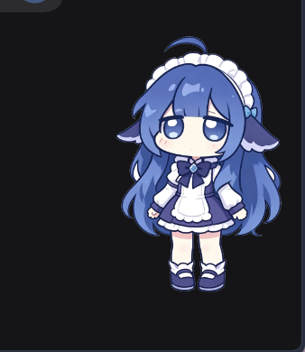

# DeskSprite 灵伴

> 一只趴在桌面上的小家伙，支持使用序列帧png文件自定义形象，支持接入deepseek来API显示余额（余额有单独的坐标，不随素材改变，建议需要使用的话提前在素材上预留显示区域）

<!-- 想换图：直接替换 docs/screenshot.png（建议宽度不超过 1000px，GIF 也行） -->


一只deepseek形象的桌宠，有眨眼，打瞌睡等待机动作，同时对鼠标的悬停和点击做出反应

Windows 10 / 11 · 免安装 · 不需要管理员权限

---

## 一、这个项目解决什么问题

想要一个自定义形象的桌宠，偶尔想要拥有显示余额的能力

这个项目支持把这个余额数字放到桌面上，查询方式为"点一下"。

有两个刻意的设计选择：

- **她不会自主查询。** 只有**启动时**和**你点她时**才会查一次余额，平时不发任何请求。没有定时轮询——这是故意的：只有你在想知道余额时，才会使用这微乎其微token完成一次查询
- **她不会挡住你的桌面。** 鼠标落在她**身上画到的像素**时窗口才吃点击；移到她周围的透明区域，点击直接穿到桌面图标上。

## 二、主要功能

| 功能 | 说明 |
|---|---|
| **右键 = 设置** | 右键点她打开设置面板，可以提供各种快捷配置，如打开调试面板，配置APIKey，配置皮肤文件夹等 |
| **点击后按ESC退出** | 在聚焦状态下按esc退出程序 |
| **点一下查余额** | 左键点她 → 在开启余额显示功能后，查询并显示在牌子上。查不到时显示 `--`，不会显示成 `0` |
| **数字位置可调** | 余额数字的位置和字号都能在设置面板里调，而且**按皮肤分别记住** |
| **拖动她** | 按住左键拖，松手就落在那里 |
| **皮肤可换** | 自带一套；把素材放进一个文件夹就能换，**不用改代码**，选中当场生效 |
| **按像素点击穿透** | 透明区域不挡桌面，桌面上任何一个图标都点得到 |
| **待机小动作** | 平时循环呼吸，过一段时间随机播一个待机池的动作，间隔可以调 |
| **无边框窗口** | 没有标题栏、没有边框 |
| **全局热键** | 不依赖窗口焦点，任何时候都能用，例如ctrl+shift+O打开配置文件夹，ctrl+shift+Q退出程序 |
| **配置存在用户目录** | `%APPDATA%\DeskSprite\`，不写进程序目录（那里可能只读） |

## 三、安装方法

### 普通用户（只要那个 exe）

1. 到本仓库的 **Releases** 页面下载最新的 zip

   <!-- 待补：发版之后把 Releases 链接贴到这里 -->

2. 解压到**任意一个文件夹**
3. 双击 `DeskSprite.exe`

> ⚠️ 不要只把 exe 单独拖出来放——它旁边的 `DeskSprite_Data\` 里放着形象素材，少了它她不显示。

不需要安装程序、不需要装 .NET、不需要管理员权限。
**卸载 = 删掉那个文件夹**，外加下面「配置放在哪」提到的配置目录。

### 开发者（想改代码 / 自己构建）

- 需要 **Unity 2022.3.62f3c1**（用 Unity Hub 安装。确切版本写在
  `DeskSprite/ProjectSettings/ProjectVersion.txt` 里，Hub 打开工程时会提示你装对应版本）
- `git clone` 本仓库
- 用 Unity Hub **打开 `DeskSprite/` 这一层目录**（不是仓库根目录），等它导入完
  —— 第一次比较久，因为 `Library/` 是导入产物，所以仓库里没有它
- `File → Build Settings` → 平台选 **Windows x64** → Build

## 四、使用方法

### 第一次：填 API Key

余额查询要用你自己的 DeepSeek API Key：

1. 在 DeepSeek 开放平台创建一个 API Key（形如 `sk-...`）
2. **右键点她** → 打开设置面板 → 在 **Key** 那一栏粘贴
3. 按回车，或点右边的 **应用** → 立刻生效
4. 再点 **保存** → 写进配置文件，以后重开程序还在

⚠️ **「应用」和「保存」是两步**：应用只对本次运行生效，不点保存的话下次开机要重填。
面板上的「保存」按钮在有未保存改动时会变成 **保存（有改动）**，关闭按钮会变成
**关闭并丢弃**，所以不会稀里糊涂丢掉改动。

Key 存在 `%APPDATA%\DeskSprite\config.json`——**不在程序目录里**。
所以程序换一版、或者整个文件夹搬走，都不用重填。

> 也可以用环境变量 `DEEPSEEK_API_KEY`（优先级更高，适合临时测试、不用把 Key 落到磁盘上）。
> 用环境变量时，程序**不会**把它抄进配置文件。

### 怎么操作她

| 操作 | 效果 |
|---|---|
| **左键点她** | 查一次余额，显示在牌子上 |
| **按住左键拖** | 移动她 |
| **右键点她** | 打开 / 关闭设置面板 |
| 鼠标移到她**周围**的透明区域 | 点击穿到桌面，不挡图标 |

### 全局热键（不需要窗口有焦点）

| 热键 | 作用 |
|---|---|
| `Ctrl+Shift+S` | 打开 / 关闭设置面板 |
| `Ctrl+Shift+Q` | 退出 |
| `Ctrl+Shift+C` | 切换窗口透明方案（备用方案，见「常见问题」） |
| `Ctrl+Shift+O` | 在资源管理器里打开配置文件 |
| `Ctrl+Shift+← → ↑ ↓` | 微调余额数字的位置（一格一格挪） |

窗口有焦点时：`Esc` 退出，`C` 切换透明方案。

### 设置面板里有什么

| 项目 | 说明 |
|---|---|
| **Key** | API Key（见上） |
| **显示余额** 开关 | 关掉之后她**完全不联网**，牌子留空 |
| **余额坐标**（X / Y / 字号 / 还原） | 数字放在她身上哪个位置、多大。**按皮肤分别记住** |
| **待机动作切换间隔** | 多久随机播一次待机动作（0 = 不等待，一直换） |
| **角色大小** | 她在桌面上的大小 |
| **皮肤**（名字 / 选择…） | 选一个文件夹当皮肤，**当场生效** |
| **保存** / **关闭设置** | 写进文件 / 退出设置 |
| 右上角「调试界面」 | 开发用的诊断信息，不进配置文件、重启就关 |

### 换皮肤

把一套皮肤素材放进一个文件夹，用设置面板的 **皮肤 → 选择…** 选中它即可，
**当场换、不用重新打包**。

皮肤目录该长什么样、`skin.json` 有哪些字段、有哪些硬性要求，
见 **《制作皮肤.md》**（里面有一份可以直接复制的模板，不用自己写）。
想直接看一个现成例子：`DeskSprite/Assets/StreamingAssets/skins/deepseek/` 就是自带的那一套。

皮肤搜索顺序（重要）：`%APPDATA%\DeskSprite\skins\`（你的）→ 程序自带的目录。

### 出问题了

| 症状 | 怎么办 |
|---|---|
| **她不见了 / 点不到** | 按 `Ctrl+Shift+S` 打开设置面板（它是个固定大小的窗口，一定在屏幕里），或 `Ctrl+Shift+Q` 退出重开 |
| **牌子上一直是 `--`** | Key 没填、填错，或者查询失败。设置面板的状态行会说明原因 |
| **她变成一个方块 / 周围点不到桌面** | 皮肤素材缺透明通道。见《制作皮肤.md》里的硬要求 |
| **她是一堆红黄格子** | 皮肤加载失败（少了 `idle/`、PNG 坏了、或者同一动作里帧尺寸不一致）。具体原因在日志里 |
| **想看日志** | `%USERPROFILE%\AppData\LocalLow\DefaultCompany\DeskSprite\Player.log` |

## 五、常见问题

**为什么没有定时刷新？**
因为"在后台悄悄联网"和"我点一下才查"是两种产品。这个项目选了后者：
不轮询、不常驻请求，你点她才是唯一的触发（外加启动时一次）。

**透明方案是什么？为什么要有备用方案？**
默认用 Windows 的 DWM 逐像素透明（效果最好）。个别显卡驱动或系统设置下它会失效
（表现是窗口变成纯黑），所以留了一个"品红色键透明"的备用方案，`Ctrl+Shift+C` 切换。

**支持 macOS / Linux 吗？**
不支持。窗口透明、点击穿透、全局热键都直接调用了 Windows 的 API。

**余额数字准吗？**
它就是接口返回的值，没有做任何加工。具体口径以 DeepSeek 开放平台为准。

## 六、项目结构

（给想读代码 / 改代码的人）

```
DeskSprite/                     Unity 工程（用 Unity Hub 打开这一层）
├── Assets/
│   ├── Scripts/                全部逻辑都在这些 .cs 里
│   └── StreamingAssets/skins/  自带皮肤（跟着 exe 走，可以直接替换）
├── Packages/                   依赖清单
└── ProjectSettings/            构建配置（产品名、目标平台、场景列表…）
_tools/                         开发用的小工具（离线编译检查、皮肤生成脚本）
_reference/                     M0 时期的骨架快照，留作对照
制作皮肤.md                     皮肤作者手册（怎么做一个自己的形象）
```

## 致谢

感谢所有开源桌面宠物项目——它们证明了"桌面上放一只会动的小东西"这件事值得认真做。

本项目的开发过程由 ailasiki 配合 DeepSeek 完成：人负责决定做什么、不做什么、以及每一版的验收；AI 负责实现和整理文档。

## 许可

代码以 **MIT License** 授权，见 [LICENSE](LICENSE) 文件 —— 拿去改、拿去用、甚至拿去卖都可以，只要保留版权声明。

> ⚠️ **授权只覆盖代码。** 仓库里自带的皮肤素材中出现的角色形象，权利归各自的权利方，
> **不在 MIT 授权的范围内**，请勿用于商业用途。想避免这个问题，就把自带皮肤换成你自己的形象。 
